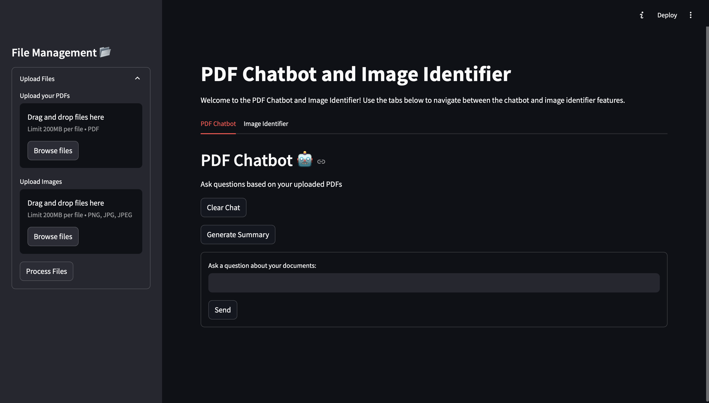
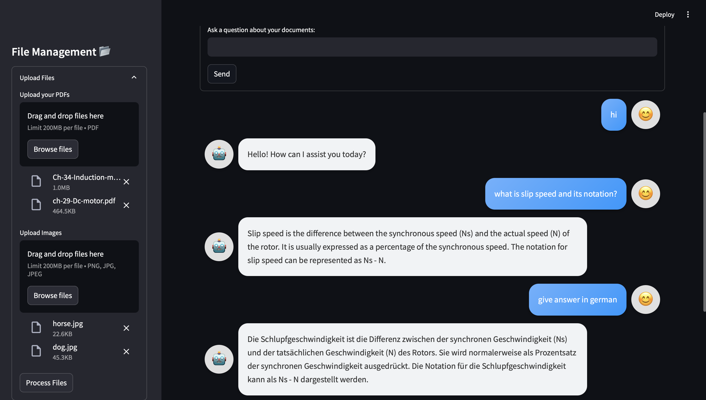
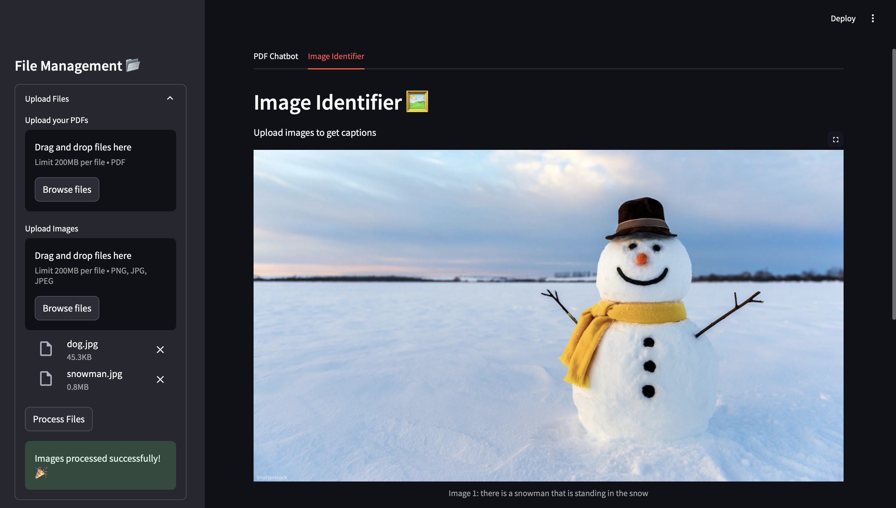
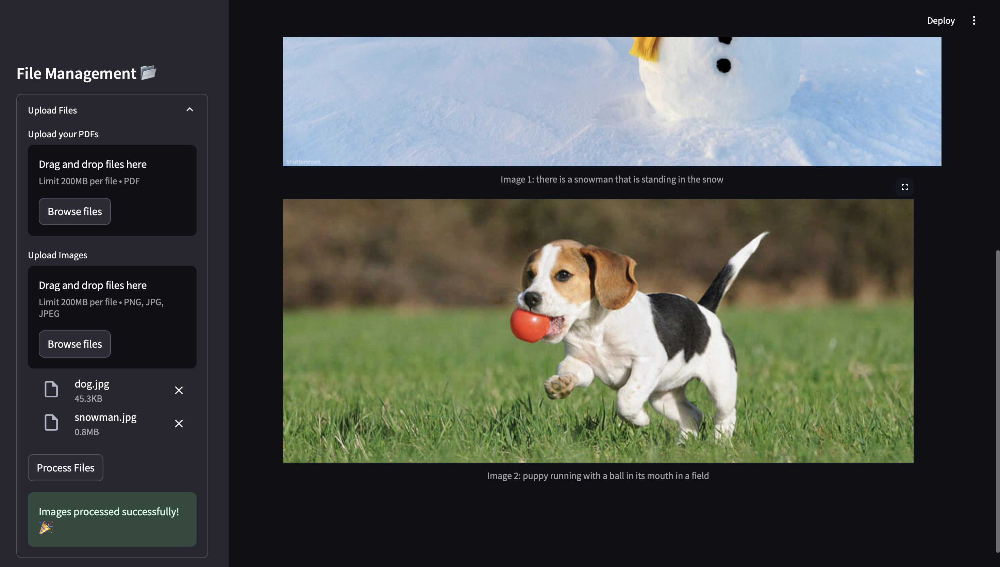

# PDF-Chatbot

# 🧠 **PDF Chatbot & Image Identifier** 🤖🖼️  

  
  
  
 

---

## 📝 **Project Overview**  
This project is a **PDF Chatbot and Image Identifier Web App** built with the following features:  
- **PDF Chatbot:** Upload one or more PDF documents and ask questions based on their content.  
- **Image Identifier:** Upload images and generate AI-powered captions using BLIP.  
- **Conversation Summarization:** Generate concise summaries of chatbot interactions.  

Technologies Used:  
- **LangChain** for document-based Q&A  
- **FAISS** for vector-based document search  
- **BLIP (Salesforce)** for image captioning  
- **Streamlit** for interactive UI  
- **OpenAI's GPT model** for chatbot interaction  

---

## 📚 **Table of Contents**  
- [🖼️ Chatbot Images](#-Chatbot-Images)  
- [🚀 Getting Started](#-Getting-Started)  
- [📚 Project Features](#-Project-Features)  
- [🛠️ Tech Stack](#-Tech-Stack)  
- [🔧 Configuration Example](#-Configuration-Example)  
- [📋 Usage Instructions](#-Usage-Instructions)  
- [⚙️ Dependencies](#-Dependencies) 

---

## 🖼️ **Chatbot Images**

### 1️⃣ **App at First Load**
  

### 2️⃣ **PDF Chatbot in Action**
  

### 3️⃣ **Image Identifier Generating Captions**
  

  

---

## 🔧 **Getting Started**  

### **Step 1: Clone the Repository**
```bash
git clone https://github.com/your-username/pdf-chatbot-and-image-captioning.git
cd pdf-chatbot-and-image-captioning
```
### **Step 2: Create and Activate a Virtual Environment**
```bash
python3 -m venv venv
source venv/bin/activate  # Windows: venv\Scripts\activate
```
### **Step 3: Install Dependencies**
```bash
pip install -r requirements.txt
```
### **Step 4: Set Up Environment Variables**

Create a ```.env``` file and add your OpenAI API key as follows:

```bash
OPENAI_API_KEY=your_openai_api_key_here
```
### **Step 5: Run the Web App**
```bash
streamlit run main.py
```
---

## 📚 **Project Features**

### 1️⃣ PDF Chatbot 🤖
Upload multiple PDFs
Ask questions based on the content of the uploaded files
Get precise answers directly sourced from your documents

### 2️⃣ Image Identifier 🖼️
Upload images (PNG, JPG, or JPEG)
AI-powered captions generated using the BLIP image captioning model

### 3️⃣ Conversation Summarization 📊
Generate concise summaries of chatbot conversations

---

## 🛠️ **Tech Stack**

- Python 3.8+
- Streamlit: Interactive web UI
- LangChain: Document-based question-answering
- OpenAI API: Language model processing
- FAISS: Vector database for efficient document search
- BLIP (Salesforce): Image captioning model
- dotenv: Environment variable management

---

## ⚙️ **Configuration Example**

Create a ```.env``` file and add your OpenAI API key:

```bash
OPENAI_API_KEY=your_openai_api_key_here
```

---

## 📋 **Usage Instructions**

### PDF Chatbot
Upload one or more PDF files
Ask questions based on the uploaded content
View chatbot responses and generate conversation summaries

### Image Identifier
Upload an image file
Get an AI-generated caption

### Managing Files
Use the sidebar to upload and manage both PDFs and images
Clear chat history or generate summaries

---

## 📚 **Dependencies**

Make sure the following packages are installed:

```bash
streamlit
pypdf2
langchain
python-dotenv
faiss-cpu
openai
transformers
langchain-community
Pillow
```

To install them, run:

```bash
pip install -r requirements.txt
```
